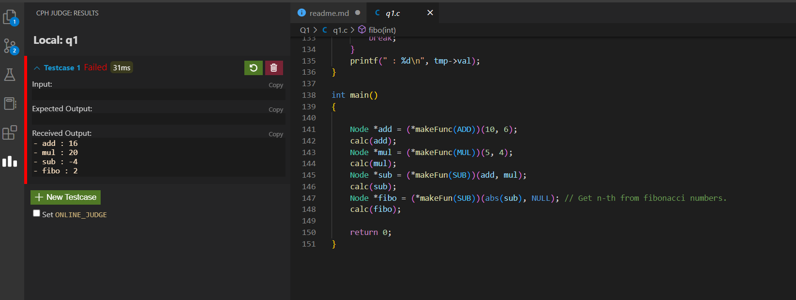

# [Question No. 1] Coding Test – Backend

## Installation

- Download and install MinGw
- Add bin folder location to environment variable
- Now compile and run `q1.c` file

## Additional Information

- As c compailer doesn't support operator overloading changed function name `makeFunc` to `makeFun` for multiple use by using different parameter

## Final Result

