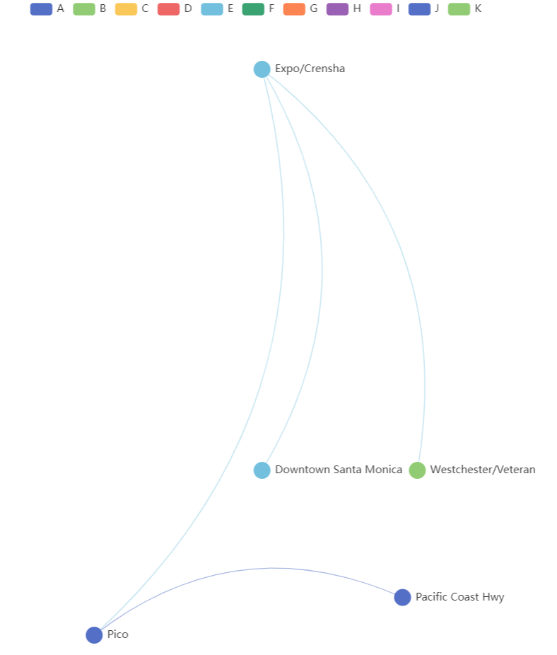

# [Question No. 4] Frontend Test - Using the Apace EChart’s Graph draw the Los Angeles Subway Network.

## Installation

- Install node
- From command prompt go to project directory
- `npm install`
- `npm start`
- visit : `http://localhost:3001/`

## Additional Information

- Only a sample data with 4 station added

## Final Result

