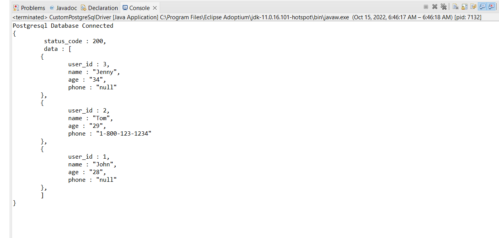

# [Question No. 5] Coding Test – Driver (Interface)

# Installation

- Install java and Eclipse IDE
- Open Project with with Eclipse
- Install postgresql with default port 5432 . If port no for your pc is different then replace your port in

```java
  String connectionURL = "jdbc:postgresql://localhost:<port>/" + dbname;
```

- add `postgresql-42.5.0` jar file to classpath.
- Relace `dbname` , `userName` and `password` according to Your PGAdmin
- Run Java Application from `CustomPostgreSqlDriver.java` ;

## Guide

- Get a connection as follow

```java
Connection connection = connect_to_db(dbname, userName, password);
```

- If you do not have table name in database then you can add table as follow

```java
CreateTableIfNotExist(connection) ;
```

- If you do not have any data in database then you can add data as follow

```java
String InsertQuery = "INSERT INTO public.user_table (user_id, name, age, phone) VALUES (1, 'John', 28, NULL);" ;
Insert(connection,InsertQuery) ;
```

- To view all rows in json format

```java
String ReadQuery = "SELECT * FROM " + dbname ;
Read(connection, ReadQuery) ;
```

- After running project you can copy json data from console

## Final Result


